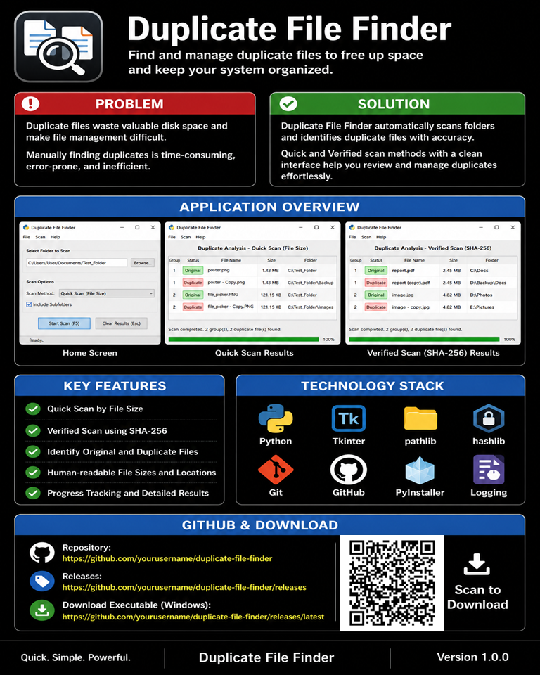
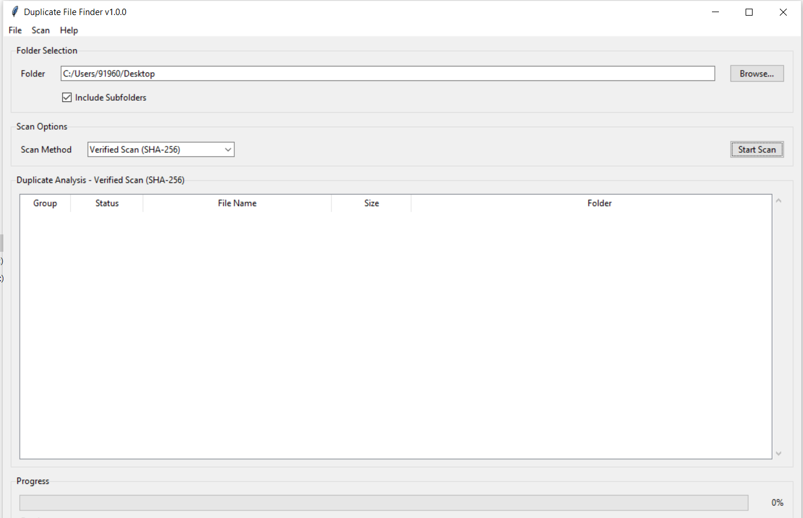
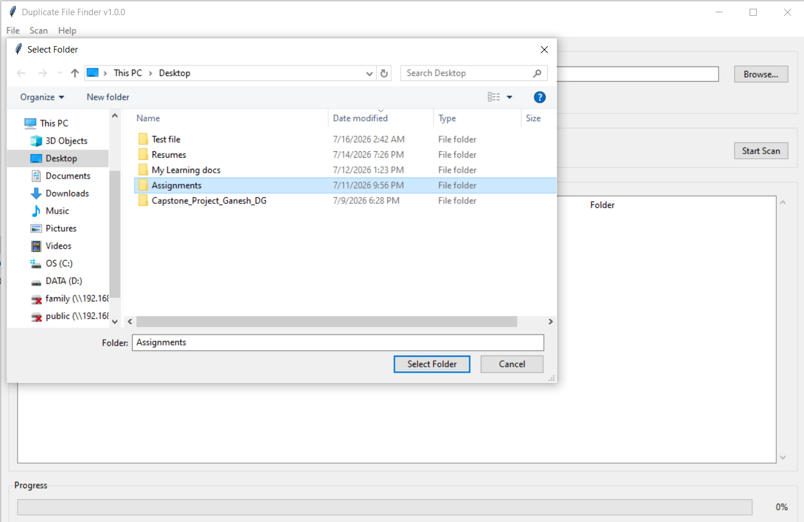
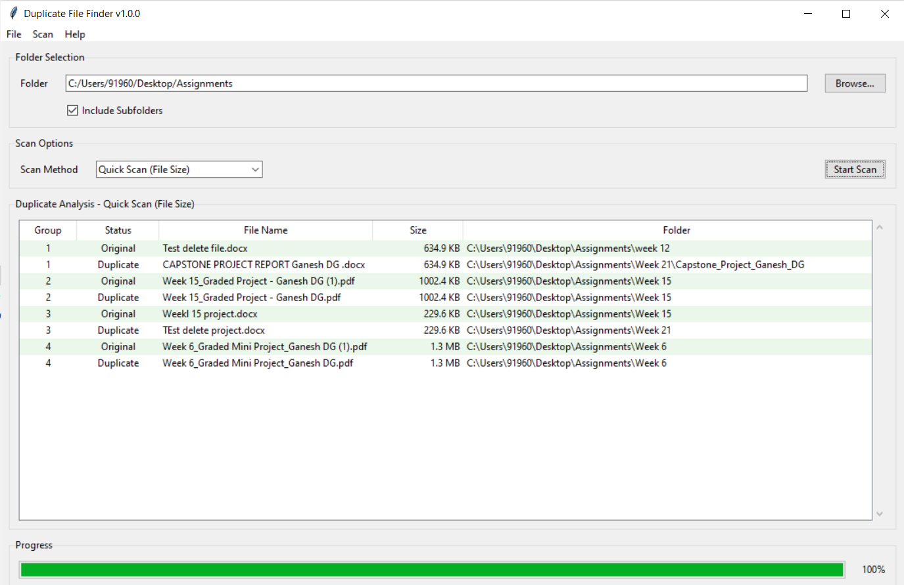
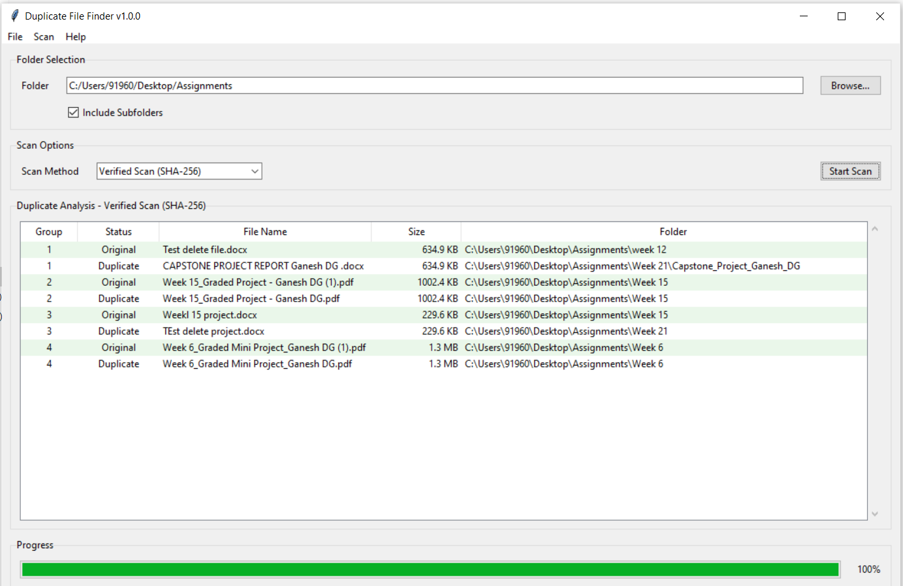

# Duplicate File Finder


---

# Screenshots

## Home Screen



---

## Folder Selection



---

## Quick Scan Results



---

## Verified Scan Results (SHA-256)



---

# Duplicate File Finder

A Windows desktop application for identifying duplicate files using either a fast file-size comparison or a verified SHA-256 hash comparison. The application provides a clean graphical interface for scanning folders, reviewing duplicate groups, and analysing duplicate files before any cleanup activity.

---

# Project Overview

## Purpose

Duplicate File Finder helps users locate duplicate files stored across one or more folders.

The application provides two scanning modes:

- **Quick Scan** – compares files using file size for fast identification.
- **Verified Scan** – confirms duplicates using SHA-256 hashing.

---

## Problem Statement

As file collections grow over time, duplicate files consume storage space and make file management increasingly difficult.

Manual identification is slow, error-prone, and impractical for large directory structures.

---

## Solution

Duplicate File Finder automates the discovery of duplicate files by recursively scanning folders, grouping matching files, and presenting the results in a clear analysis view.

Users can review duplicates before taking further action.

---

## Typical Use Cases

- Organising personal documents
- Cleaning download folders
- Removing duplicate photographs
- Managing backup folders
- Identifying redundant project files
- Freeing storage space

---

# Project Highlights

| Attribute | Value |
|------------|-------|
| Language | Python 3.14 |
| GUI Framework | Tkinter |
| Architecture | Layered |
| Platform | Windows |
| Executable | Yes |
| Logging | Yes |
| Scan Modes | 2 |
| Duplicate Detection | File Size & SHA-256 |
| Current Version | v1.0.0 |

---

# Features

- Quick Scan using file size comparison
- Verified Scan using SHA-256 hashing
- Recursive folder scanning
- Duplicate group analysis
- Original and duplicate identification
- Human-readable file sizes
- Progress tracking
- Status reporting
- Modular layered architecture
- Standalone Windows executable

---

# Technology Stack

| Technology | Purpose |
|------------|---------|
| Python 3.14 | Programming language |
| Tkinter | Desktop user interface |
| pathlib | File system navigation |
| hashlib | SHA-256 duplicate verification |
| logging | Application logging |
| dataclasses | Data models |
| PyInstaller | Executable generation |
| Git | Version control |
| GitHub | Source code hosting |

---

# Architecture

The application follows a layered architecture that separates the user interface, business logic, data models, and supporting services. This separation improves maintainability, readability, and extensibility.

```text
                     +----------------------------+
                     |        User Interface      |
                     |----------------------------|
                     | Folder Panel              |
                     | Options Panel             |
                     | Results Panel             |
                     | Progress Panel            |
                     | Menu Bar                 |
                     +-------------+------------+
                                   |
                                   v
                     +----------------------------+
                     |   Application Controller   |
                     |----------------------------|
                     | Event Handlers            |
                     | Callbacks                |
                     +-------------+------------+
                                   |
                                   v
                     +----------------------------+
                     |      Core Processing       |
                     |----------------------------|
                     | Scan Engine              |
                     | Duplicate Detector       |
                     | Attribute Matcher        |
                     | Content Matcher          |
                     | Validation              |
                     +-------------+------------+
                                   |
                    +--------------+--------------+
                    |                             |
                    v                             v
        +----------------------+      +----------------------+
        |      Services        |      |       Models         |
        |----------------------|      |----------------------|
        | File Service         |      | File Record          |
        | Hash Service         |      | Duplicate Group      |
        | Logging Service      |      | Scan Settings        |
        +----------------------+      +----------------------+
```

---

# Project Structure

```text
Duplicate File Finder
│
├── assets/
│
├── data/
│   ├── input/
│   ├── output/
│   └── samples/
│
├── docs/
│
├── releases/
│
├── screenshots/
│
├── src/
│   ├── core/
│   ├── models/
│   ├── services/
│   ├── ui/
│   └── utils/
│
├── tests/
│
├── main.py
├── requirements.txt
├── pyproject.toml
├── LICENSE
└── README.md
```

---

# Module Overview

| Module | Responsibility |
|----------|----------------|
| UI | User interface, menu system, panels, progress display and user interaction |
| Core | Duplicate detection algorithms, validation and scan execution |
| Services | File enumeration, hashing and logging |
| Models | Application data structures shared between modules |
| Configuration | Centralised application constants and configuration |
| Assets | Icons, images, fonts and templates |
| Documentation | User guide and supporting documentation |
| Screenshots | Images used within the README and User Manual |
| Releases | Versioned release artifacts |
| Tests | Test workspace and sample datasets |

---

# Design Principles

The project has been designed around the following engineering principles.

- Layered architecture
- Separation of concerns
- Modular implementation
- Object-oriented design
- Single responsibility per module
- Configuration-driven behaviour
- Reusable services
- Readable and maintainable code
- Minimal external dependencies
- Desktop-first user experience

---

# Scan Modes

## Quick Scan

Quick Scan groups files based on their file size.

Advantages

- Extremely fast
- Suitable for large folders
- Minimal processing overhead

Limitations

- Files with identical sizes are considered potential duplicates.
- Does not verify file content.

---

## Verified Scan (SHA-256)

Verified Scan computes a SHA-256 hash for each file before determining duplicates.

Advantages

- Byte-for-byte duplicate verification
- Eliminates false positives
- Suitable for accurate duplicate detection

Trade-off

- Slower than Quick Scan because every file must be read completely.

---

# Engineering Workflow

The application processes duplicate detection using the following workflow.

```text
Select Folder
      │
      ▼
Validate Settings
      │
      ▼
Enumerate Files
      │
      ▼
Quick Scan
      │
      ├────────────► Attribute Matching
      │
      ▼
Verified Scan
      │
      ├────────────► SHA-256 Hashing
      │
      ▼
Duplicate Groups
      │
      ▼
Duplicate Analysis View
```

---

# Source Code Overview

## Application Entry Point

| Source File | Purpose | Dependencies |
|------------|---------|--------------|
| `main.py` | Application entry point. Creates the main window, initialises all UI components and starts the application event loop. | Tkinter, src.ui, src.config |

---

## Configuration

| Source File | Purpose | Dependencies |
|------------|---------|--------------|
| `src/config.py` | Central configuration containing application constants, default settings, scan modes and UI configuration values. | Python Standard Library |

---

## Core Modules

| Source File | Purpose | Dependencies |
|------------|---------|--------------|
| `src/core/scan_engine.py` | Coordinates the complete duplicate scanning workflow from file discovery through duplicate grouping. | Models, Services, Duplicate Detector |
| `src/core/duplicate_detector.py` | Determines duplicate groups by selecting the appropriate matching strategy based on the chosen scan mode. | Attribute Matcher, Content Matcher |
| `src/core/attribute_matcher.py` | Detects potential duplicates using file attributes such as file size. Used by Quick Scan. | Models |
| `src/core/content_matcher.py` | Confirms duplicate files using SHA-256 hashes. Used by Verified Scan. | Hash Service, Models |
| `src/core/validation.py` | Validates user selections and scan settings before processing begins. | Models |

---

## Models

| Source File | Purpose | Dependencies |
|------------|---------|--------------|
| `src/models/file_record.py` | Represents an individual file discovered during scanning including metadata and duplicate information. | dataclasses, pathlib |
| `src/models/duplicate_group_model.py` | Represents a group of duplicate files returned by the scan engine. | dataclasses |
| `src/models/scan_settings.py` | Stores all scan configuration selected by the user. | dataclasses, pathlib, config |

---

## Services

| Source File | Purpose | Dependencies |
|------------|---------|--------------|
| `src/services/file_service.py` | Enumerates files from the selected folder and builds FileRecord objects. | pathlib, Models |
| `src/services/hash_service.py` | Calculates SHA-256 hashes used for verified duplicate detection. | hashlib |
| `src/services/logging_service.py` | Configures application logging and provides a shared logger instance. | logging |

---

## User Interface

| Source File | Purpose | Dependencies |
|------------|---------|--------------|
| `src/ui/folder_panel.py` | Allows users to select folders and configure recursive scanning. | Tkinter |
| `src/ui/options_panel.py` | Provides scan mode selection and scan configuration options. | Tkinter |
| `src/ui/results_panel.py` | Displays duplicate analysis results including groups, status, file sizes and folder locations. | Tkinter, Models |
| `src/ui/progress_panel.py` | Displays scan progress, status updates and completion messages. | Tkinter |
| `src/ui/menu_bar.py` | Creates the application's menu system including File, Scan and Help menus. | Tkinter |
| `src/ui/event_handlers.py` | Connects user interface events to callback methods. | Callbacks |
| `src/ui/callbacks.py` | Coordinates communication between the UI and the application core. | Scan Engine, Models |

---

## Utilities

| Source File | Purpose | Dependencies |
|------------|---------|--------------|
| `src/utils/` | Reserved for reusable helper utilities shared across multiple modules. | — |

---

# Code Statistics

| Metric | Value |
|---------|------:|
| Python Source Files | 17 |
| Core Modules | 5 |
| UI Modules | 7 |
| Service Modules | 3 |
| Model Classes | 3 |
| Configuration Modules | 1 |
| Application Entry Point | 1 |
| Architecture | Layered |
| Programming Language | Python 3.14 |

---

# Dependency Flow

```text
main.py
    │
    ▼
UI Layer
    │
    ▼
Callbacks
    │
    ▼
Core Engine
    │
    ├──────────────► File Service
    │
    ├──────────────► Hash Service
    │
    └──────────────► Models
```

---

# Design Characteristics

The project follows a modular layered architecture where each source file has a clearly defined responsibility.

Key characteristics include:

- Single Responsibility Principle
- Layered Architecture
- Modular Components
- Configuration Driven
- Reusable Services
- Model Based Data Exchange
- Low Coupling
- High Cohesion
- Object-Oriented Design
- Extensible Project Structure

---

